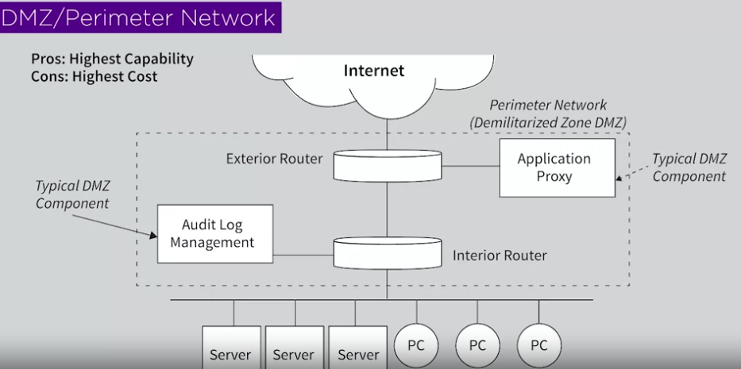

## Firewall Architecture.
So the building blocks of a demilitarized zone or perimeter network consist basically of a packet filter and application proxy. Those are the two main components that comprise this thing we sort of call a perimeter network.

### frist architecture 

The first architecture involves internet, your LAN, and a router essentially providing packet filtering as the firewall, as the network.
So you can have a routing device as your DMZ.
- Advantage: cheap, simple, easy.
- Disadvantage: Not much functionality there, right.
Not too much you can do to sort of drop or allow packets,

--- 

### second architecture

Option 2, is you can put a packet filter in place and you can hang an application proxy off of it. So routers have multiple interfaces. And the way routers work is they steer traffic right. So one possibility is you steer the traffic through the router to the LAN or from the LAN depending on which direction the packet's headed. Another is the router can make the decision to forward to a proxy to do something at the application level.

- advantages : Well, it gives you more capabilities certainly than just a router,
but it's little more expensive.

---

### third architecture

Third option, is probably the way almost every big business, every government agency, every military, even more substantive organization would do it.
And that's to build something we would call a demilitarized zone or a perimeter network. And the way we do that is we put one router in place facing say the untrusted side of the ecosystem, the internet, you call that your exterior router and then put another router facing your LAN, facing the stuff that you're trying to protect. We call that an interior router. So you an exterior, interior. And those two routers share an interface and that interface, that network is where you can expand and put all kinds of interesting components. You put application proxies. In fact, you can put application firewalls for all kinds of different protocols. You can decide I want to load balance all of the HTTP traffic to this device. I want to load balance email traffic to this device or whatever.

---

>  So really fundamentally you have these three options: a router, a firewall which potentially includes routing capability, or a network.

---

> **As You simplify, as you bring the complexity down, you will bring the security up.**

> **So if you have a big complex organization and if you don't have a easy way to protect it, ask yourself is there a way for you to break the big to small?**

---

## Management by Exception
You can collect the log and look at it (log audit) and stare for the thing that are unusual, an expection, out of ordinary that might means that there is a security issue.
> Management by Exception :  It means that you watch network behavior. You watch it on an hourly basis. You watch on a daily basis. You watch on a weekly basis. You watch on a monthly basis, year. and you keep track of and building a profile, an understanding of what's normal. You characterize based on observation, based on actual data. You don't posit or theorize a profile. **And when When observed is different than expected, there could be a problem in that correlation.**

---
## Auditing
1. Internal
- Generation data natively
2. External
- Outside systems to collect data

three level of auditing : application, system and network level.

---

## Signature base Intrucsion Detection Systems.
IDS Takes the data, and try to make some determination based on a set of signatures. So pre-determined descriptions of attack patterns that we would code right into the Intrusion Detection, or we call them IDS. We coded right into the IDS, and then with ding an alarm.
And there's basically four steps :

There is two ways that you can implemet the signature base IDS :
1. Inside a network like shown above called **NIDS**.
2. Implement this capability right into hosts called **HIDS**.

HIDS, sits on a host. Both of them collect data. Both of them have signatures. Both observe traffic or compute activity. And both, if a signature is matched, will notify some security server, or the security team, or sound the bell.

> Just making an attacker change their behavior in order to not be caught in some signature that I've designed. When we change that behavior, what we call that, the word we use, is **variant.**

---

## Cyber/Thread/Attack Hunter.
Hunter is a human being working in a security operations center for a company, or government agency, or military. And what they do is they have information that they have access to. They pull that information. They do analysis on the information, that's hunting, and they try to come up with some sort of a conclusion. We call that intelligence where you take raw data, you process it, and the process of coming up with the conclusion. We actually used the word derive, like sometimes you'll say, we derive intelligence from data collection and analysis. **You collect data, you analyze, you derive intelligence.
We call that whole process, threat hunting or hunting.**

---
## shun spoof problem
if I'm Alice, that I'm somebody else. And let's say I'm saying I'm George, and maybe I want to really make sure George can't connect to this server. I know George's IP address, so I change it to George's IP address. I start sending sync flood packet and traffic through the IPS. It gets annoyed with what it's seeing. Boom, it puts a rule in that will block George's source IP from hitting the server. It's a way of, in some sense, tricking the IPS shun mechanism into locking out a victim from gaining legitimate access to a server. It's a weakness in IPSs, in fact, it's such a significant weakness that if you talk to a lot of security teams, they'll tell you they run their IPS in passive mode.

---

## SIEM (Security Information Event Management)
In every moment a lot of logs are genereted. System logs, application and network logs, to make sense of each audit log you can develop or have different programs. (even this is hard to follow because there are be alot of logs to look at.)

SIEM save us here. it has the ability to translate, or to accommodate a model all of these logs.You set an common data models, after that all the logs must first translate to the default model and then managed by the SIEM, this way you can get logs from a linux o.s., an network device or what so ever and put them in same format and display them using SIEM.

What would be hard about runnign a SIEM ? Developing the connector. (there are a lot devices like smartphone, computers , modems ...)

---
## SOC (Security Operation Center)
What does Security Operation Center does is to collect alot of raw data, perform differnet Analysis on data and Drive an intelligence out of the data.

.
Now, most security operations centers think of what they're doing in kind of two dimensions. There's internal information, so if you're a SOC for a bank, then there's data that's coming directly from the infrastructure that you control as a bank. It's your firewalls, your system, your logs, your applications, all your stuff, and you can think of that as private, right? That's not something that you're out spilling out on the Internet although a lot of people talk about the idea of sharing threat information, that's for another discussion. But you have internal logs and records of data. But correspondingly, you also have external data that you're pulling from the Internet, that you're pulling from your vendors, that you might be learning from customers. In fact, you may be pulling it from your third parties. You could have suppliers, vendors, all these other companies that help you in the support of your mission. So a SOC has to pull things internally and make sense out of it, externally and make sense. And what we refer to that as, the term we use to refer to that is all-source data collection and correlation. 

> When I'm pulling internal and pulling external, we refer to that as **all-source**.

**Fusion :** Fusing thing that are coming from different sources. a big fusion center is one where data with differing characteristics, differing attributes is put together into a common data model along the lines of what we saw when we studied the way a security information event management system, a SIM, works.

