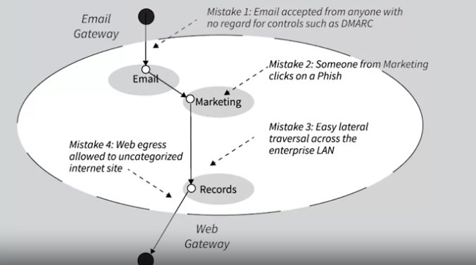

## Auditor
it's a third party individual who may work in your company. But if somebody is going to come take a look at what you're doing, provide oversight, and make sure that, for example, you have the right controls in place to protect the business. Turns out, that that auditor is going to demand evidence that you're protecting things properly.

## APT(Advanced Persistent Threat)
APT are the attacks that target more specific organizations like military and use more sophisticated tools and are dangerous. 

some mistake that end up to the advance threat and problems :

A typical ATP attack will have the following six phases: (1) reconnaissance and
weaponization; (2) delivery; (3) initial intrusion; (4) command and control; (5)
lateral movement; (6) data exfiltration

## Third Party Security
if you running an business party is sort of an entity.
- The First Party is == You
- The Second Party is == Your Customer
- The Thired Party are ==  organizations that sit in support of your mission to your customer.(It could be a lawyer, context center, vendor, an auditor, marketing experts, it could be consultants. These are all third parties that only exist to help you serve your customer.)

Note : In most of businesses the second party (customer) see the first and thrid parties as first party and as one. So if Third party fails to implement security and customers loss their data then they will mostly blame you and your business.

## Layer 7 application DDOS risk
as an example, Suppose you had a website with an application that allowed people to download information. And so you have a library of all sorts of different things that you've created. And they might be sizable, might be image libraries or something that are big monster things with video and multimedia and all kinds of stuff. And you're a very kind hearted soul and you give it all away for free. So if somebody comes to your site and they want to request a bunch of the download, you've coded it up where you say hey, want to download stuff, go right ahead. And it may be that most of the time people are very reasonable about that. They download what's reasonable. They don't download any more. But what if a bot net noticed that your server was sitting in a network or hosting center in a business where I'd like to cause problems for that business, and I see that your little server allows a lot of traffic to go out. So what I do is I'd have a bunch of bots then requesting big monster downloads. And what would happen is all that traffic on egress to your gateway out to the Internet would create a gigantic traffic jam in the enterprise. The ISP wouldn't see any of it because these are just little normal requests. Hey, download all this stuff. Nothing else. And then boom, a big barrage of stuff. Not packet, packet, packet, attack, attack, attack, session. All the kinds of things you see layer three. So you'd have an attack on egress from an amplifying source that's hidden to the DDos scrubbing that we've all become so comfortable with as our primary solution for denial of service.