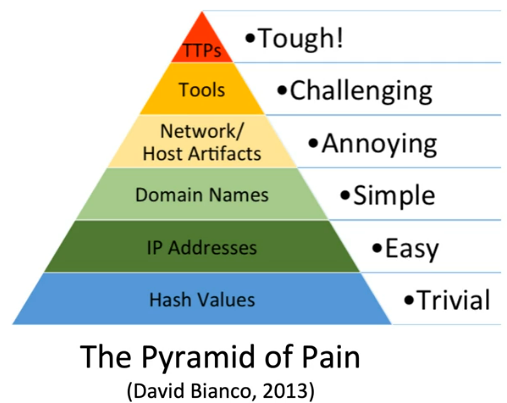

As with any crime, adversaries leave traces behind during cyberattacks, and each trace is referred to as an "indicator of compromise" (IOC). An IOC is evidence that a cyberattack has taken place.

Indicators of Compromise give valuable information about what has happened, prepare defenders for future attacks, and help prevent, detect, and respond to similar attacks. However, there are various types of indicators that do not have the same importance, with some being much more valuable than others. Therefore, the differences between the indicators have led to the need for a classification system. 

He named the pyramid "the Pyramid of Pain" due to the fact that each level is proportional to the pain both security professionals and adversaries feel. 

As we climb to the upper levels of the pyramid, it becomes increasingly difficult (painful) for security professionals to collect and apply indicators. However, it also becomes difficult for adversaries to replace them with new ones. 

For example, according to a security professional's point of view, it is easy to obtain and incorporate the hash values of malicious files into security controls, but it isn't easy to define and apply TTPs (Tactics, Techniques, and Procedures) into security tools. 

From an adversary's perspective, changing the hash value of a malware file is very simple; however, it is challenging and costly to change TTPs. 

The MITRE ATT&CK framework systematically defines and organizes TTPS. 
- It is a globally accessible public knowledge base based on real-world observations of adversary operations.
- It has become a Common Language between security teams to describe TTPs.
- The other important aspect of MITRE ATT&CK is that it is a community-driven initiative; therefore, it is a compelling framework as the whole global security community can contribute to it. 

**Tactic :** "What goals are adversaries trying to achieve?"

**Technique :**  Techniques describe "how" an adversary accomplishes of tactical goal through an action or a series of actions. 

Adversaries use many techniques to achieve their overall mission. Besides, a technique can be used to achieve multiple goals. Therefore, a technique can be categorized under multiple tactics.

**procedures :** how  goals are implemented.

**sub-technique :**A sub-technique is a way to describe a specific implementation of a technique in more detail. 

Software is categorized into malware and tools in the MITRE ATT&CK framework. 
- Commercial, custom closed source, or open source software that is intended to be used for malicious purposes by adversaries falls under the "malware" category. 
- Commercial open-source, built-in, or publicly available software that could be utilized by a defender, penetration tester, red teamer, or attacker is included in the "tools" category. Tools can be software that isn't typically found on an enterprise system, such as Mimikatz, Metasploit, and Empire. Moreover, tools can be commonly available as part of an operating system or can be already installed on a system, such as certutil, netstat, and bitsadmin, which are also referred to as "living off the land" tools. Emerging threat actors, such as the DarkSide ransomware group, heavily use these publicly available and living off the land tools. 